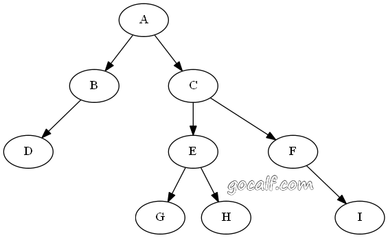
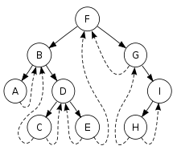
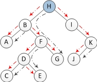

这个笔记记录的是各种树形的数据结构和操作方法。

基本概念：

+ 树的度。节点最大的度称为树的度
+ 树中节点的度。树中节点的度表示为孩子节点的个数。

常用结论：树的总结点数 = 树中节点度数之和 + 1

###二叉树

说到二叉树就有二叉树的各种操作。最常用的还是几种遍历的方式，前序（pre-order，NLR）、中序（in-order，LNR）、后序（post-order，LRN）、层序（level-order）。前、中、后是指根结点的访问时机，在左、右子树之前、中间、或之后。



上图中的二叉树对应的遍历的结果是

+ 前序（NLR）：`A B D C E G H F I`
+ 中序（LNR）：`D B A G E H C F I`
+ 后序（LRN）：`D B G H E I F C A`
+ 层序：`A B C D E F G H I`

如果给定三种序列，前序，中序和后序。前序和中序，中序和后序都能唯一确定一颗二叉树。但是前序和后序不能，因为给出这两个序列不能确定左右子树的情况

####二叉树的非递归遍历
在实现遍历的过程中有递归和非递归的实现方式。递归的方式较为简单，直接看代码就行。非递归的实现都使用栈保存需要遍历的节点信息。前序遍历和中序遍历类似不同地方就是节点的访问顺序，就以中序遍历为例。循环结束的条件是当前节点为空且栈为空，否则就一直执行循环体：判断当前节点是否为空，不为空则将当前节点入栈，当前节点指向其左子节点;如果当前节点为空，且栈非空，当前节点指向栈顶，弹栈，访问当前节点，当前节点指向当前节点的右子节点。


后序遍历要稍微复杂一些。前序遍历和中序遍历过程中，在进入右子树的时，根节点就已经被弹栈了。但是在后序遍历的过程中仍然需要保留，直到右子树遍历完成。我们直接的想法是不要从栈s中将根结点弹出，而是直接开始处理右子结点。但这就会带来一个问题：什么时候弹出根结点？实际上当左子树遍历完成、或者右子树遍历完成时，我们都会在栈里看到根结点，为了区分这两种状态，添加一个临时变量记录前一次访问的结点，如果前一个结点是根结点的右子树，就说明左右子树全都遍历完成了。非常简单。

所以整个后续遍历的算法流程是。循环结束的条件是当前节点(cur)为空且栈顶为空，否则就一直执行循环体：判断当前节点是否为空，不为空则将当前节点入栈，当前节点指向其左子节点;如果当前节点为空(就需要判断是否要出栈)，但是栈顶的元素的右子节点不等于pre(之前访问的节点)，那么cur 就等于栈顶元素的右子节点，pre置为空。其他情况就是pre = 栈顶元素，访问栈顶元素，弹栈


####二叉树的Morris遍历

在前面的二叉树的遍历方式中为了在访问完子节点能够重新回到父节点，使用了一个栈的辅助空间，使得空间复杂度变成O(n)。Morris算法能够在相同的时间复杂度情况下做到O(1)的空间复杂度。为了解决前面的问题，Morris使用了线索二叉树(threaded binary tree)的概念，threaded binary tree对普通二叉树进行了一些改造，将每一个节点在中序遍历时的前驱节点的右子树指向自己。线索二叉树的样子大概是这样的



##### Morris中序遍历
步骤：

1. 如果当前节点的左孩子为空，则访问当前节点并将其右孩子作为当前节点。
2. 如果当前节点的左孩子不为空，在当前节点的左子树中找到当前节点在中序遍历下的前驱节点
    - 如果前驱节点的右孩子为空，将它的右孩子设置为当前节点。当前节点更新为当前节点的左孩子。
    - 如果前驱节点的右孩子为当前节点，将它的右孩子重新设为空（恢复树的形状）。访问当前节点。当前节点更新为当前节点的右孩子。
 3. 重复1,2过程，直到当前节点为空
 
下面的一个图很清楚地表示以上过程。下图为每一步迭代的结果（从左至右，从上到下），cur代表当前节点，深色节点表示该节点已输出。


时间复杂度分析：n个节点的二叉树中一共有n-1条边，整个过程中每条边最多只走2次，一次是为了定位到某个节点，另一次是为了寻找上面某个节点的前驱节点，如下图所示，其中红色是为了定位到某个节点，黑色线是为了找到前驱节点。所以复杂度为O(n)。




##### Morris前序遍历

Morris的前序遍历和中序遍历完全一样，只有一个地方不同，就是在访问节点的时机

1. 如果当前节点的左孩子为空，则访问当前节点并将其右孩子作为当前节点。
2. 如果当前节点的左孩子不为空，在当前节点的左子树中找到当前节点在中序遍历下的前驱节点。
    + 如果前驱节点的右孩子为空，将它的右孩子设置为当前节点。访问当前节点（在这里访问，这是与中序遍历唯一一点不同）。当前节点更新为当前节点的左孩子。
    + 如果前驱节点的右孩子为当前节点，将它的右孩子重新设为空。当前节点更新为当前节点的右孩子。
3. 重复以上1、2直到当前节点为空。

算法的执行流程图解


##### Morris后序遍历

后续遍历稍显复杂，需要建立一个临时节点dump，令其左孩子是root。并且还需要一个子过程，就是倒序输出某两个节点之间路径上的各个节点。

步骤：

当前节点设置为临时节点dump。

1. 如果当前节点的左孩子为空，则将其右孩子作为当前节点。
2. 如果当前节点的左孩子不为空，在当前节点的左子树中找到当前节点在中序遍历下的前驱节点。
     +  如果前驱节点的右孩子为空，将它的右孩子设置为当前节点。当前节点更新为当前节点的左孩子。
     + 如果前驱节点的右孩子为当前节点，将它的右孩子重新设为空。倒序访问从当前节点的左孩子到该前驱节点这条路径上的所有节点。当前节点更新为当前节点的右孩子。
3. 重复以上1、2直到当前节点为空。

上面的流程中为什么这么做是对的不太清楚，大家可以看图理解一下。在实现的过程中关键是逆序输出那块，我们知道需要逆序输出的是一个头为cur->left，尾节点为pre的单向链表。为了做到O(1)的空间复杂度，需要将单链表反转，遍历输出后，再反转(恢复原来状态)

算法的执行流程图解


以上算法的一个样例代码

```
#include<iostream>
#include<stack>
using namespace std;
struct TreeNode
{
    int val;
    TreeNode *left;
    TreeNode *right;
    TreeNode(int x) : val(x), left(NULL), right(NULL) {}
};
class BinaryTree
{
private:
    void visit(TreeNode *node)
    {
        cout<<(char)node->val;
    }
	//反转一个单链表，单链表通过right指针相连，from链表头，to链表尾部
	void reverse(TreeNode *from, TreeNode *to)
	{
		TreeNode *head = from, *cur = from->right, *tmp;//head表示新链表头，cur表示现在需要反转的节点
		while(head != to)
		{
			tmp = cur->right;
			cur->right = head;
			head = cur;
			cur = tmp;
		}
	}
public:
	//中序非递归遍历
	void inorder(TreeNode *root)
	{
		stack<TreeNode *> st;
		while(root || st.size())
		{
			if(root)
			{
				st.push(root);
				root = root->left;
			}
			//左子树遍历完成
			//这里不需要判断!root && !st.emtpy()，因为前面一个循环判断了root是否是空，root为空才能走这个else分支，而且while循环保证了root和st里面至少一个非空，此时root为空，st肯定非空
			else
			{
				root = st.top();
				st.pop();
				visit(root);
				root = root->right;
			}
		}
	}
	//前序非递归
	void preorder(TreeNode *root)
	{
		stack<TreeNode *> st;
		while(root || st.size())
		{
			if(root)
			{
				visit(root);
				st.push(root);
				root = root->left;
			}
			else
			{
				root = st.top();
				st.pop();
				root = root->right;
			}
		}
	}
	//后序非递归
	void postorder(TreeNode *root)
	{
		stack<TreeNode *> st;
		TreeNode *pre = 0;//保存当前结点的前一次访问节点
		while(root || st.size())
		{
			if(root)
			{
				st.push(root);
				root = root->left;
			}
			else if(st.top()->right != pre)//右子节点没有被访问过
			{
				root = st.top()->right;
				pre = 0;//移动到右子树之后，重置之前的访问信息，防止右子节点为空而无限循环
			}
			else
			{
				pre = st.top();
				visit(pre);
				st.pop();
			}
		}
	}
	void Morris_inorder(TreeNode *cur)
	{
		TreeNode *pre = 0;
		while(cur)
		{
			if(!cur->left)//左子树为空
			{
				visit(cur);
				cur = cur->right;
			}
			else//在左子树中寻找当前节点的前驱节点
			{
				pre = cur->left;
				while(pre->right && pre->right != cur)
					pre = pre->right;

				if(!pre->right)//前驱节点的右子节点为空
				{
					pre->right = cur;//设置线索
					cur = cur->left;//当前节点向左子树移动
				}
				else//前驱节点的右子树非空需要此时还原二叉树
				{
					visit(cur);
					pre->right = 0;
					cur = cur->right;
				}
			}
		}
	}
	void Morris_preorder(TreeNode *cur)
	{
		TreeNode *pre = 0;
		while(cur)
		{
			if(!cur->left)
			{
				visit(cur);
				cur = cur->right;
			}
			else
			{
				pre = cur->left;
				while(pre->right && pre->right != cur)
					pre = pre->right;

				if(!pre->right)
				{
					pre->right = cur;
					visit(cur);
					cur = cur->left;
				}
				else
				{
					pre->right = 0;
					cur = cur->right;
				}
			}
		}
	}
	void Morris_postorder(TreeNode *cur)
	{
		TreeNode *pre = 0, dummy(0), *tmp;
		dummy.left = cur;
		cur = &dummy;
		while(cur)
		{
			if(!cur->left)
				cur = cur->right;
			else
			{
				pre = cur->left;
				while(pre->right && pre->right != cur)
					pre = pre->right;

				if(!pre->right)
				{
					pre->right = cur;
					cur = cur->left;
				}
				else
				{
					reverse(cur->left, pre);
					//反转之后正常访问
					tmp = pre;
					while(tmp != cur->left)
					{
						visit(tmp);
						tmp = tmp->right;
					}
					visit(cur->left);

					reverse(pre, cur->left);

					pre->right = 0;
					cur = cur->right;
				}
			}
		}
	}

};


int main()
{
    BinaryTree bt;
    TreeNode a('A');
    TreeNode b('B');
    TreeNode c('C');
    TreeNode d('D');
    TreeNode e('E');
    TreeNode f('F');
    TreeNode g('G');
    TreeNode h('H');
	TreeNode i('I');
	a.left = &b, a.right = &c;
	b.left = &d;
	c.left = &e, c.right = &f;
	e.left = &g, e.right = &h;
	f.right = &i;
	bt.Morris_postorder(&a);
	cout<<endl;
	bt.postorder(&a);
	cout<<endl;
    return 0;
}


```


**内容来自**

[程序基本功之遍历二叉树](http://www.gocalf.com/blog/traversing-binary-tree.html) 

[Morris Traversal方法遍历二叉树（非递归，不用栈，O(1)空间）](http://www.cnblogs.com/AnnieKim/archive/2013/06/15/MorrisTraversal.html#3699291)


